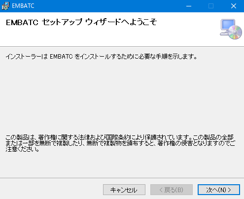
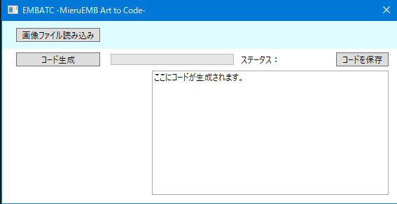
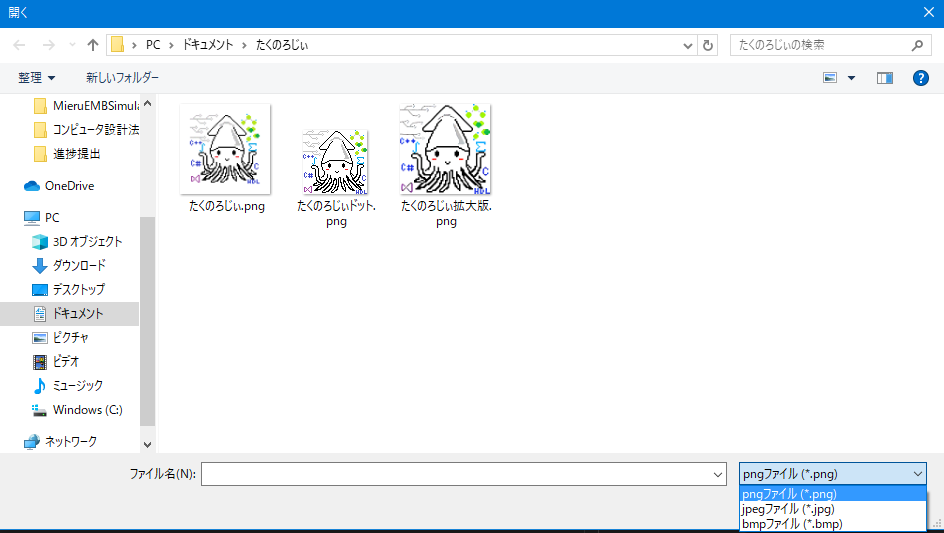
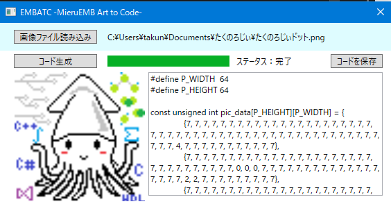
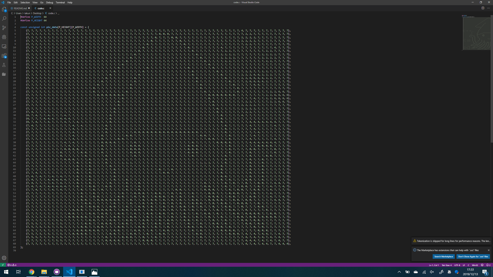

# EMB-ArtToCode (EMBATC)

## EMBATC ver1.0.0
ドット絵をコードに変換するツールです。 
Windows上でのみ動きます。(Macの人ごめんなさい)

## インストール
[release](https://github.com/takunology/EMBATC/releases) のほうから "EMBATCSetup.msi" を選択してダウンロードしてください。発行者不明と出ますが許可してあげてください。 

あとはインストーラの指示に従ってインストールしてください。 

## 使い方
インストール先のフォルダに exe ファイルがあるので開いてください。こんな画面が表示されます。 

### 1. 画像を選ぶ
こんな画面が出てくるので、まずは "画像ファイル読み込み" をクリックします。対応形式は Jpeg, png, bmp の3種類です。128 x 128 以上の画像は読み込めません。
 

### 2. コード生成
画像を開いたら "コード生成" をクリックし、ステータスが "完了" になるまでしばらく待ってください。ちなみに 128 x 128 ピクセル の画像だと生成までに30秒以上かかります。 

### 3. コードを保存
生成されたコードはテキストボックス上でドラッグアンドドロップでコピーもできますが、cコードとして保存もできます。VScodeやSublimeなどのエディタ環境がある人は、保存したほうが見やすくなります。

VScodeで開くとこのようになります。

### 4. main.cへの書き換え
生成されたコードをそのまま貼り付ければ、その画像を表示できます。

 

------
皆さんも良きMieruEMBライフを。 
P.S. 色の調整が完全ではないのでそこは勘弁してください。